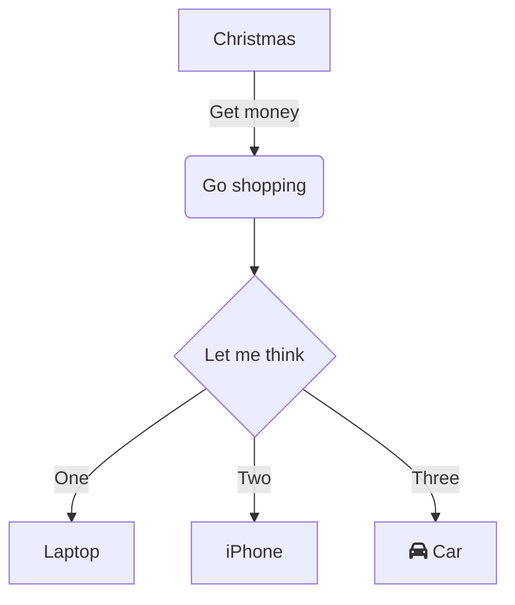

# Proyecto 
### proyecto de integraci'on de sistema de login y stock

#### Instalaci'on
    ```ps
    git clone http://repo
    cd repo
    cd front && npm i
    cd ../back && npm i 

    ```


# Rutas Backend
- /productos - POST 
`Ruta encargada de crear un nuevo producto, requiere lo siguiente`
    - body:
        ```ts
        {
            nombre:"string",
            price:'decimal',
            stock:"integer"
        }

        ```
    - headers:
        ```ts
        {
            authorization:"string"
        }
        ```
    - Returns:
        - 200 OK: 

        - 404 Not Found


    - Ejemplo:
    ```js

        // bloque de codigo de react puede ser

    ```



